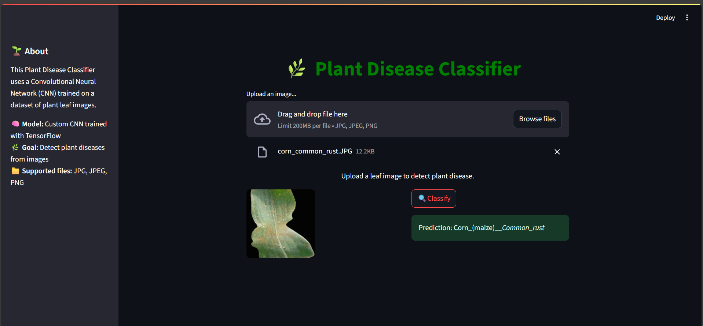

# 🌿 Plant Disease Detection using CNN

This project is a deep learning-based web application that identifies **plant diseases from leaf images**. It uses a **Convolutional Neural Network (CNN)** trained on the PlantVillage dataset and is deployed using **Streamlit** for easy accessibility through a browser interface.

---

## 📌 Features

- 🌱 Detects 38 different plant diseases  
- 📷 Upload any leaf image (JPG, PNG)  
- ⚡ Real-time prediction with high accuracy  
- 🖥️ Clean and responsive web interface  
- 🧠 Powered by TensorFlow and Keras  

---

## 🧠 Model Overview

- **Architecture**: Custom CNN with 2 Conv layers, MaxPooling, Dense layers  
- **Framework**: TensorFlow / Keras  
- **Input Image Size**: 224x224  
- **Training Accuracy**: ~97%  
- **Test Accuracy**: ~96%  

---

## 🛠️ Tech Stack

| Tool             | Purpose                          |
|------------------|----------------------------------|
| Python           | Programming                      |
| TensorFlow/Keras | Model training & inference       |
| PIL / NumPy      | Image preprocessing              |
| Streamlit        | Web interface                    |
| Google Colab     | GPU-based model training         |
| GitHub           | Version control & hosting        |

---

## 📄 Report

📎 [Download the Final Project Report (PDF)](Plant_disease_detection_report.pdf)

---
## 🔗 Trained Model File

➡️ [Download plant.keras from Google Drive](https://drive.google.com/file/d/1XjwuVmvagywO8tbqXz0N70_NgH8ilx-f/view?usp=sharing)

📌 After downloading, place the file in the same directory as the Streamlit app (`streamlit_app.py`).

## 🔍 Dataset

- **Source**: [https://www.kaggle.com/datasets/abdallahalidev/plantvillage-dataset]  
- **Classes**: 38 disease categories  
- **Total Images**: ~43,000+  

---
## 🖼️ Demo

Here’s how the web app looks:

