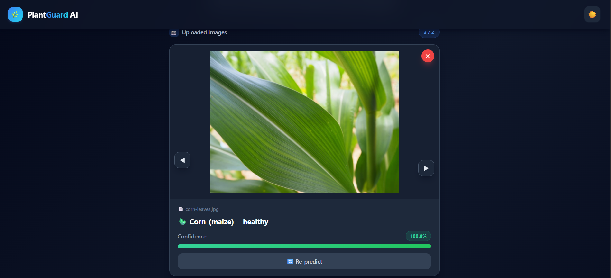

# 🌿 Plant Disease Detection using CNN

A full-stack web application that identifies **plant diseases from leaf images** using a **Convolutional Neural Network (CNN)** trained on the PlantVillage dataset. The project features a **FastAPI** backend for inference and a modern **React + Vite** frontend with a premium dark-mode UI.

---

## 📌 Features

- 🌱 **38 Disease Classes** — Covers diseases across 14 crop species
- 📷 **Image Upload** — Drag-and-drop or click to upload JPG / PNG leaf images
- 🔬 **Bulk Prediction** — Analyze multiple images in a single request with fault-tolerant processing
- ⚡ **Real-Time Inference** — Get predictions with confidence scores instantly
- 🌙 **Dark Mode** — Premium glassmorphism UI with smooth animations (Framer Motion)
- 🛡️ **Robust Error Handling** — Per-image failure isolation; one bad image won't crash the batch

---

## 🧠 Model Overview

| Property              | Details                                  |
|-----------------------|------------------------------------------|
| **Architecture**      | Custom CNN — 2 Conv layers, MaxPooling, Dense layers |
| **Framework**         | TensorFlow / Keras                       |
| **Input Size**        | 224 × 224 × 3 (RGB)                     |
| **Normalization**     | Pixel values scaled to `[0, 1]`          |
| **Training Accuracy** | ~97%                                     |
| **Test Accuracy**     | ~96%                                     |
| **Model Format**      | `.keras` (TensorFlow SavedModel)         |

---

## 🛠️ Tech Stack

### Backend
| Technology         | Purpose                          |
|--------------------|----------------------------------|
| Python 3.10+       | Core language                    |
| FastAPI            | REST API framework               |
| Uvicorn            | ASGI server                      |
| TensorFlow / Keras | Model loading & inference        |
| Pillow             | Image preprocessing              |
| NumPy              | Array operations                 |

### Frontend
| Technology       | Purpose                          |
|------------------|----------------------------------|
| React 19         | UI framework                     |
| Vite             | Build tool & dev server          |
| Tailwind CSS     | Utility-first styling            |
| Framer Motion    | Animations & transitions         |
| Axios            | HTTP client for API calls        |

### Other
| Tool             | Purpose                          |
|------------------|----------------------------------|
| Streamlit        | Legacy standalone demo app       |
| Google Colab     | GPU-based model training         |
| GitHub           | Version control & hosting        |

---

## 📂 Project Structure

```
plant_disease_detection/
├── backend/
│   ├── app/
│   │   ├── main.py                  # FastAPI app — routes & CORS
│   │   ├── services/
│   │   │   └── prediction.py        # Model loading & inference logic
│   │   ├── utils/
│   │   │   └── image_processing.py  # Image preprocessing pipeline
│   │   ├── models/                  # (reserved for schemas)
│   │   └── api/                     # (reserved for route expansion)
│   ├── class_indices.json           # Disease class index → name mapping
│   ├── plant_final.keras            # Trained CNN model (not in repo)
│   └── requirements.txt            # Python dependencies
│
├── frontend/
│   ├── src/
│   │   ├── App.jsx                  # Main app with state management
│   │   ├── api.js                   # API client (single + bulk predict)
│   │   ├── components/
│   │   │   ├── Navbar.jsx           # Navigation bar with dark mode toggle
│   │   │   ├── UploadArea.jsx       # Drag-and-drop image upload
│   │   │   ├── ImagePreview.jsx     # Image carousel with per-image predict
│   │   │   ├── ResultCard.jsx       # Prediction result display
│   │   │   ├── Loader.jsx           # Loading spinner
│   │   │   └── Footer.jsx           # Footer component
│   │   ├── index.css                # Global styles & design tokens
│   │   └── main.jsx                 # React entry point
│   ├── package.json
│   └── vite.config.js
│
├── app.py                           # Legacy Streamlit app
├── .gitignore
└── readme.md
```

---

## 🚀 Getting Started

### Prerequisites

- **Python** 3.10 or higher
- **Node.js** 18+ and npm
- **Git**

### 1. Clone the Repository

```bash
git clone https://github.com/rujula-singh/plant_disease_detection_using_cnn_project.git
cd plant_disease_detection_using_cnn_project
```

### 2. Download the Trained Model

📥 [**Download `plant_final.keras` from Google Drive**](https://drive.google.com/file/d/1XjwuVmvagywO8tbqXz0N70_NgH8ilx-f/view?usp=sharing)

Place the downloaded file in the `backend/` directory:

```
backend/plant_final.keras
```

### 3. Setup Backend

```bash
cd backend

# Create and activate virtual environment
python -m venv venv
venv\Scripts\activate        # Windows
# source venv/bin/activate   # macOS/Linux

# Install dependencies
pip install -r requirements.txt

# Start the API server
uvicorn app.main:app --reload --port 8000
```

The API will be available at `http://localhost:8000`.

### 4. Setup Frontend

```bash
cd frontend

# Install dependencies
npm install

# Start the dev server
npm run dev
```

The frontend will be available at `http://localhost:5173`.

---

## 📡 API Endpoints

### Health Check

```
GET /
```

**Response:**

```json
{ "message": "Plant Disease Detection API is running!" }
```

### Single Prediction

```
POST /predict
Content-Type: multipart/form-data
Body: file (image)
```

**Response:**

```json
{
  "status": "success",
  "disease": "Tomato___Late_blight",
  "confidence": 0.9842
}
```

### Bulk Prediction

```
POST /predict/bulk
Content-Type: multipart/form-data
Body: files[] (multiple images)
```

**Response:**

```json
{
  "total": 3,
  "success": 2,
  "failed": 1,
  "results": [
    { "image": "leaf1.jpg", "status": "success", "prediction": "Apple___Black_rot", "confidence": 0.9721 },
    { "image": "leaf2.jpg", "status": "success", "prediction": "Grape___healthy", "confidence": 0.9954 },
    { "image": "doc.pdf", "status": "failed", "error": "Invalid image format" }
  ]
}
```

---

## 🌾 Supported Crops & Diseases

The model can classify **38 categories** across **14 crop species**:

| Crop                | Diseases Detected                                                   |
|---------------------|----------------------------------------------------------------------|
| 🍎 Apple            | Apple Scab, Black Rot, Cedar Apple Rust, Healthy                     |
| 🫐 Blueberry        | Healthy                                                              |
| 🍒 Cherry           | Powdery Mildew, Healthy                                              |
| 🌽 Corn (Maize)     | Cercospora Leaf Spot, Common Rust, Northern Leaf Blight, Healthy     |
| 🍇 Grape            | Black Rot, Esca (Black Measles), Leaf Blight, Healthy                |
| 🍊 Orange           | Huanglongbing (Citrus Greening)                                      |
| 🍑 Peach            | Bacterial Spot, Healthy                                              |
| 🫑 Pepper (Bell)    | Bacterial Spot, Healthy                                              |
| 🥔 Potato           | Early Blight, Late Blight, Healthy                                   |
| 🫐 Raspberry        | Healthy                                                              |
| 🫘 Soybean          | Healthy                                                              |
| 🎃 Squash           | Powdery Mildew                                                      |
| 🍓 Strawberry       | Leaf Scorch, Healthy                                                 |
| 🍅 Tomato           | Bacterial Spot, Early Blight, Late Blight, Leaf Mold, Septoria Leaf Spot, Spider Mites, Target Spot, Yellow Leaf Curl Virus, Mosaic Virus, Healthy |

---

## 🔍 Dataset

- **Source**: [PlantVillage Dataset on Kaggle](https://www.kaggle.com/datasets/abdallahalidev/plantvillage-dataset)
- **Classes**: 38 disease categories
- **Total Images**: ~43,000+

---

## Application Preview


---

## 📜 License

This project is for educational and research purposes.

---


